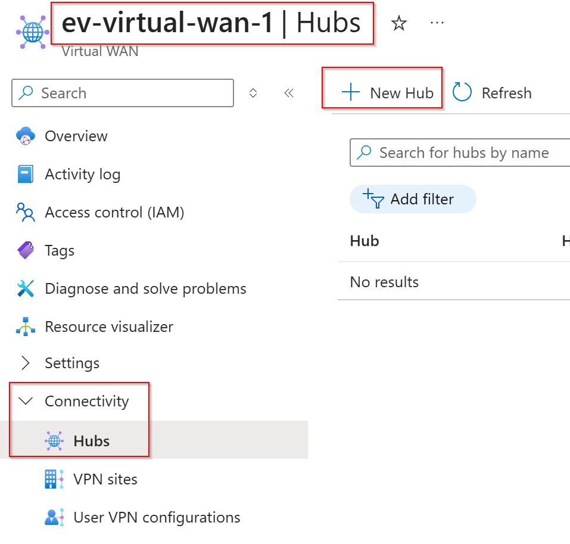
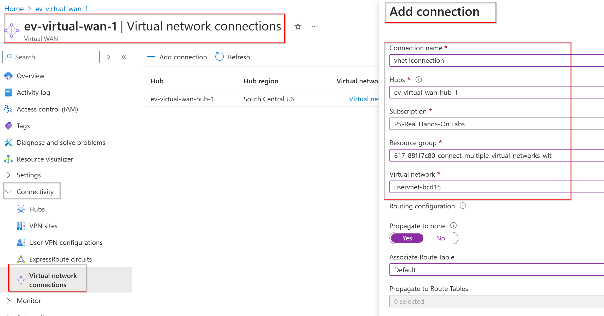
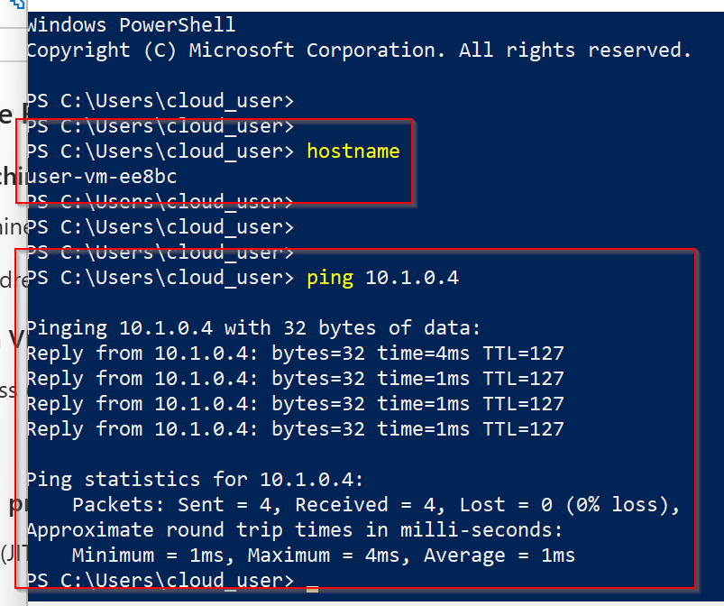

# Connect Multiple Virtual Networks with Azure Virtual WAN

**There are 4 objectives with this lab:**
* Create an Azure Virtual WAN
* Create a Virtual Hub Inside of the Azure Virtual WAN
* Connect the Virtual Networks to the Virtual WAN
* Test Connectivity Between the VMs

## Create an Azure Virtual WAN

Alright I've never worked with Virtual WANs before but there's a first time for everything! It seems like a more dynamic way to put together an Azure network environment. Is it necessary? No, but we'll still show it some love. 

Lets get logged into our A Cloud Guru (ACG) lab environment. We have a pre-generated resource group (RG) that has our User and Server virtual machines (VMs) and virtual networks (VNets), respectively. 

The end goal is to be able to reach the server VM from our user VM using ICMP traffic (ping). 

 

Lets show our lack of connectivity first by logging into our user VM and pinging the server VM. Click on the User VM and under the Connect > Connect blade, you'll see `Download RDP file` which will allow you to RDP into our VM. Use the lab-provided credentials to log into the device. 

 

The private IP of the server VM is `10.1.0.4` which you can find on the server VM's network interface card (NIC) resource so lets bring up Powershell, verify we're logged into the user VM using `hostname`, and then ping the server VM's private IP. It should fail all 4 times which you can see below. Lets try to change that!

 

Lets go to our Azure search bar and type in Virtual WAN. It'll be in the same section as Hybrid connectivity resources such as ExpressRoute and VPN gateways. Navigate to Virtual WAN > Virtual WANs and press Create +. Lets create the resource in the same location as our other resources. 

 

Lets create the resource in the same location as our other resources. Keep everything else as default. Now lets finish by clicking Review + Create. 

 

Now our overall Virtual WAN resource is created! Lets create the hub now. 

## Create a Virtual Hub Inside of the Azure Virtual WAN

Once our resource is created, lets dive into the resource and under Connectivity > Hubs, lets create a hub by selecting + New Hub at the top of the screen. 

 

Give your Hub a unique name and we're assigning the it a CIDR of `10.2.0.0/16` because we already assigned out other two VNets `10.0.0.0/16` and `10.1.0.0/16`. We chose the lowest virtual hub capacity because we're not doing much with this Hub. We also left the hub routing preference as default. You can choose from ExpressRoute, VPN, and AS (BGP) I believe. We left the rest of the pages default as well. Hit Review + Create to jump to the next section!

 

## Connect the Virtual Networks to the Virtual WAN

Lets connect our initial VNets to the hub so they can start to communicate. We're going to give both connections a unique name and give them the default associated routing table. 

 

You should see the new VNet connections in the table under your Hub!

 

## Test Connectivity Between the VMs

Lets log back into our user VM and try to ping the server VM. It should connect now. 

 

Great! We configured a basic instance of Azure Virtual WAN, hub, and connected two VNets together to allow communication amongst their resources. Good job! (Thank you (No, thank you)). 

Alright I need to get a life. 

## Personal Notes

This lab was ridiculously long while being very simple. With that being said, I don't like Virtual WAN. It's too slow!